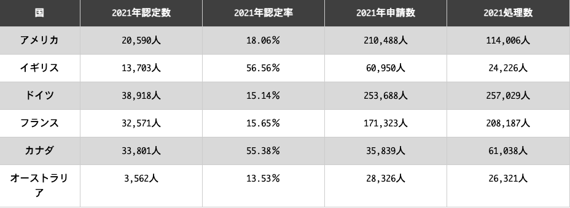
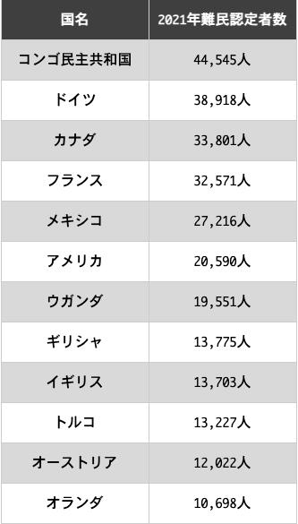
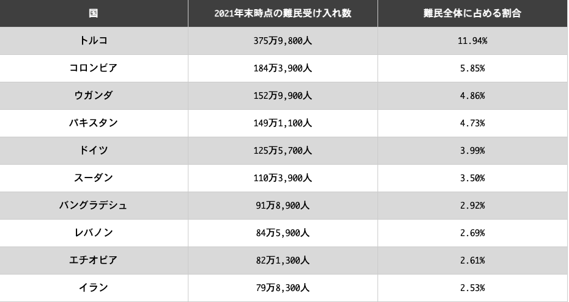
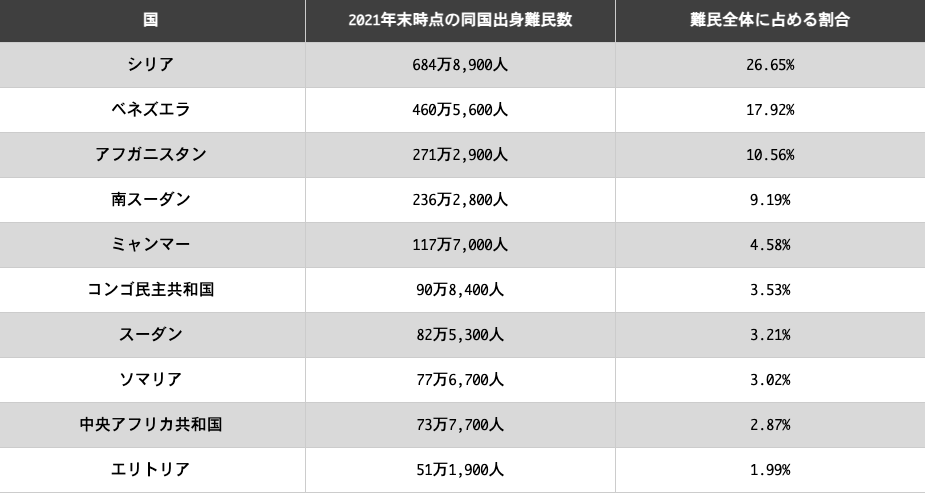
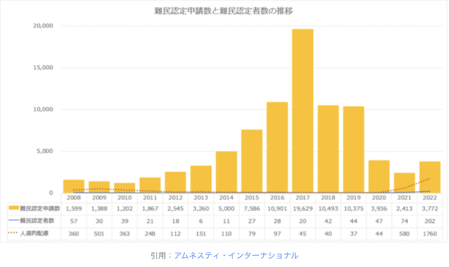
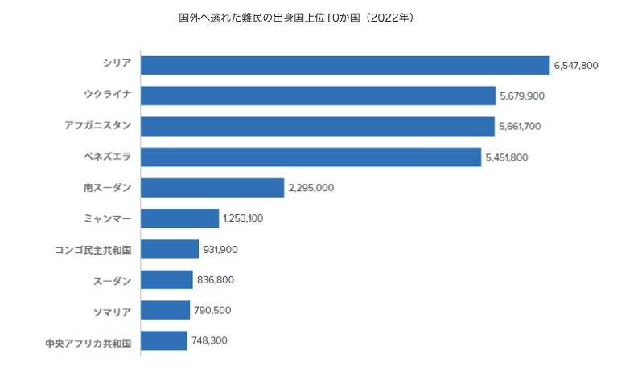
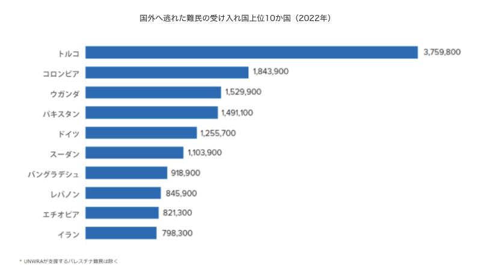

## Presentation Research

### [難民認定者数と認定率の世界比較、受け入れ数ランキングや日本の現状](https://www.worldvision.jp/children/crisis_27.html#d0e9d87eb78fa54e47cd213ca7606442)
  - 主要国の難民認定者数と難民認定率
 

  - 世界で難民認定者数が多い上位12カ国
 

  - 難民受け入れが多い上位の国
 

  - 難民の主な出身国
 

  - 日本の難民認定者数
 

   - 2021年に日本で難民申請を行った外国籍の人は合計2,413人で、審査の結果、難民として認定されたのは65人でした。このほか、過去に難民認定を申請した際に難民と認定されなかった外国人が、2021年に審査請求(不服申し立て)を行って難民と認められた例が9件。最終的に2021年に日本で認定された難民は、合計74人となっています。なお、2021年に行われた審査請求は合計4,046件でした。この74人という数は、日本の1年間の難民認定数としては過去最多です。認定された難民を国籍別に見ると、実に32人がミャンマー人で、近年のミャンマーでの政情不安が影響していることがわかります。
  - 難民認定以外での日本での難民の受け入れや在留許可
 
    - 日本では、2010年から「第三国定住」と呼ばれる制度をとおして難民の受け入れも行っています。これは、難民が最初に保護を求めた国から、彼らを定住者として受け入れることに同意した第三国へと移動する制度です。第三国定住の対象となるのは、すでに難民として認定されている人々です。多数の難民を受け入れている保護国からほかの国に難民を移すことで、保護国への負担を軽くし、国際社会が責任を分担し合う仕組みと言えます。2021年には受け入れはありませんでしたが、日本はこの取り組みをとおして現在までに194人の難民を受け入れています。さらに、日本では難民認定申請の審査の結果、難民と認定されなかった場合でも、人道的な配慮を理由に在留を認める場合があります。この仕組みのもと、2021年には合計580人が在留を認められました。配慮の理由としては、本国の情勢などが挙げられています。特にこの年は、ミャンマーで国軍によるクーデターが発生したことで抗議デモが活発化し、国軍や警察の発砲等により市民が死亡・負傷する事案が報告されるなど、情勢の不透明感が増しました。これを受けて、本国情勢を踏まえた在留ミャンマー人への緊急避難措置として、「特定活動」という在留資格でミャンマー人の日本への在留を認めることが決まりました。これもあって、難民認定数同様に、2021年は在留許可の数も過去最多となっています。
  - 日本の難民認定や難民受け入れに関する近年の変化
 
    - 上述のとおり、2021年には、ミャンマーの情勢悪化を受けてミャンマー人の難民認定やミャンマー人への在留許可が多く行われ、難民認定者数や在留許可数は過去最多を記録しました。なお、上で触れたミャンマー人に対する緊急避難措置に基づき、日本では2022年3月末までに約4,600件の在留資格を許可しています。もともと、この在留資格は6カ月間有効なもので、就労も認められていました。しかし、ミャンマー情勢に改善が見られないことから、日本は2022年4月から在留許可の期間を1年に延長するなどの措置を実施。さらにミャンマー人の受け入れ態勢を拡充しています。このほかにも、2022年7月にトルコ国籍のクルド人が日本で初めて難民と認定され、主要メディアでも報道されました。初回の難民申請が2018年に不認定となり、裁判を経て不認定処分が取り消されていましたが、「迫害の恐怖を抱く客観的事情がある」として、このクルド人申請者が難民に当たるとの判断が下されました。日本の難民認定者数は世界的に見れば小規模ですが、このような近年の変化を見ると、徐々に拡大していく兆しがあると言えるかもしれません。
   
### [難民認定率、日本はたった0.3%。日本が難民受け入れに厳しい理由とは](https://gooddo.jp/magazine/peace-justice/refugees/923/)

  - 世界中で、紛争や内戦による迫害や恐怖から逃れようとする難民の数は8,930万人にも上ります。2021年の統計によると世界の難民のうち日本の難民認定申請者数は*2,413人*でした。これら大勢の難民認定申請者数のうち、実際に日本で難民認定を受けることができた人は*74人*となり、認定率は**0.3％** なのです．
 
  - 法務省によると、日本の難民認定数が少ないのはそもそも本当に難民認定が必要な人の申請数が少ないためである、と述べているようですが、0.3％という数値は世界の難民受け入れと比べてかなり低くなっています。ただし、難民認定は得られなくても在留が認められるケースもあります。人道的な理由の配慮から、在留資格を得ることができ、日本で職業につくこともできます。また、国民健康保険を取得することもできる場合もあります。このように、条約難民として認定されなくても日本で在留が認められている人はいますが、難民を受け入れる数は他の先進国と比較して少ないという事実は変わりません。それだけでなく、日本は「難民申請の厳格化」を決定しました。

  - 難民の日本での生活は？
    - 日本で暮らす難民の人々は、どのように生活しているのかについてお伝えします。難民の人たちは、日本で生活するために難民申請をします。難民申請の結果が出るまで平均2年半以上、人によっては10年以上かかる場合もあるのです。難民申請中は「特定活動」という就労が認められる在留資格を与えられます。ただし国民年金、児童扶養手当、福祉手当などの受給は認められません。国民健康保険に加入できないので、病院もすべて自費で払うことになり、大きな負担になります。難民として認定されれば国民年金、児童扶養手当、福祉手当などの受給が認められ、日本国民と同じ待遇を受けることが可能です。また難民認定後5年以上在留し、要件を満たすと永住権が取得できます。日本に難民として逃れてきた直後は、着の身着のままで、住む場所もなくホームレス同然の人もいます。そんな身寄りのない難民の力になるため、難民支援協会では支援活動を実施中です。衣食住や就労、法的支援など様々な角度でのサポートをしています。
  - なぜ日本は難民認定率が低く難民に対して厳格なのか
 
    - 理由①就労目的による難民認定申請を防止するため
      - 日本では2010年に、すべての難民認定申請者に対して一律で就労を許可することにしました。その結果、本当に避難生活を余儀なくされ支援を必要としている難民ではなく、出稼ぎを目的として難民認定を受けようとする人が急増したのです。これらの状況を考慮に入れ、2018年には一律での就労許可を廃止し、各国の大使館に周知することによって難民認定申請の門をさらに狭めました。つまり、日本は難民に対して厳しく、受け入れる姿勢がなっていないわけではなく、偽装難民の在留を防止するために厳格化しているということになります。
    - 理由②「難民」の定義が狭いため
      - 日本が加入している難民条約では難民が定義されています。その定義によると、自国にいると迫害を受ける恐れがあるために他国に逃れる人々が難民であるということです。しかし、この条約は政治亡命者を念頭に置かれており、現在の紛争や内戦による難民には当てはまらない点もあります。そのため、日本の法務省は紛争や内戦から逃れてきた人々を「難民」と認めないことがあるのです。迫害を受ける可能性があるかどうかの証明が求められ、迫害の程度も判断基準の材料となります。このように、難民であるかどうかを判断する際の「難民」の定義が狭いため、難民認定申請を却下されてしまうことは少なくありません。
     
### [日本の難民認定はなぜ少ないか？－制度面の課題から](https://www.refugee.or.jp/refugee/japan_recog/)

  - 「日本は難民認定が少なすぎる」-「いや、数の問題ではない。ちゃんと審査をやった結果が少ないだけだ」
  - 日本は、世界でも類を見ない極めて少ない難民認定数。
    - 2023年は、13,823人が難民申請を行い、認定されたのは303人でした。一方で、7,627人が不認定とされています（一次審査・審査請求の合計）。認定数は過去最多となりましたが、依然として審査数に対して非常に少ない認定数といえます。各国の置かれた状況は違うため単純比較はできませんが、世界でも類を見ない極めて少ない認定数であることは事実です。例えば、シリア難民の認定率（2020年）は、ドイツでは78％、アメリカでは62%、オーストラリアでは89%ですが、日本では、2011年から2020年の間で117人が申請したところ、認められた人は22人（※ 決定数に対して22％）に留まっています。数だけが問題ではないとはいえ、これだけの大きな差があるのはなぜなのでしょう。日本の難民受け入れについては、大きく以下2点の基準のあり方に問題があります。
    1．誰を「難民」と認定するかに関する基準（認定基準）
    2．手続きが適正に行われているかに関する基準（手続き基準）

### [難民の受け入れと海外の反応｜難民と世界の現状を読み解く](https://www.worldvision.jp/children/crisis_04.html#d0e9d87eb78fa54e47cd213ca7606442)

  - 難民の定義
    - 国連広報センターによると難民とは「迫害のおそれ、紛争、暴力の蔓延など、公共の秩序を著しく混乱させることによって、国際的な保護の必要性を生じさせる状況を理由に、出身国を逃れた人々」を指します。難民条約でも、国境を越えて逃れた人々を難民と定義しています。同じように迫害や紛争に直面しながらも、国境を超えることができずに国内で避難生活を送っている人々は、国内避難民と呼ばれています。しかし、国境を越えていないために難民の定義から外れてしまい、支援の対象外になってしまうことが問題になっています。
  - 難民を含めた強制移動の数は世界で7000万人
    - 国連広報センターによると難民とは「迫害のおそれ、紛争、暴力の蔓延など、公共の秩序を著しく混乱させることによって、国際的な保護の必要性を生じさせる状況を理由に、出身国を逃れた人々」を指します。難民条約でも、国境を越えて逃れた人々を難民と定義しています。同じように迫害や紛争に直面しながらも、国境を超えることができずに国内で避難生活を送っている人々は、国内避難民と呼ばれています。しかし、国境を越えていないために難民の定義から外れてしまい、支援の対象外になってしまうことが問題になっています。
  - 難民の生活
    - 難民の2人に1人が子ども。11万1,000人が家族とはぐれている。
    - ウガンダでは、5歳未満の難民の子ども2,800人が家族とはぐれている。
    - 難民の61%が都市部に暮らしている。
    - 難民の受け入れ数は、高所得国は1,000人につき平均2.7人。
    - 中・低所得国は1,000人につき平均5.8人。
    - 世界の難民の3分の1は最貧国に集中している。
    - 難民の約8割は出身国の近隣国に避難している。
    - 難民の5人のうち4人の避難生活が5年以上。5人に1人は20年、もしくはそれ以上。
    - 108人に1人が難民・国内避難民・庇護申請者。10年前は160人に1人。
  - 日本の難民受け入れの現状と課題
    - 日本の難民認定は難しいという印象
      - 法務省のデータによると、平成30年度に日本で難民認定を申請者したのは10,493人。そのうち難民として認定されたのは42人、難民とは認められないものの人道的な配慮を理由に在留を認めた外国人が40人という結果でした。日本で難民認定を受けるのは難しいという印象です。日本政府が難民受け入れを始めたのは1978年、インドシナ難民が対象でした。2006年までに約11,000人を受入れ、その多くは神奈川県、埼玉県、兵庫県などで暮らしています。また、日本は2010年より「第三国定住」のパイロットプログラムを開始しました。これはアジア地区では初めての事例です。日本の難民認定は厳格であると言われていますが、政府や市民の取り組みによって、改善に向かっていると言えるでしょう。
    - 日本の難民受け入れの課題
      - 日本は難民条約加入国であり、難民条約に記されている「人種、宗教、国籍もしくは特定の社会的集団の構成員であることまたは政治的意見を理由に迫害を受けるおそれがある」という難民の定義をほかの国に比べて厳格に守っています。今日では武力紛争や人権侵害などを逃れるために国境を越えて他国に庇護を求める人々のことも指すようになっています。しかし、難民条約の定義を厳格に守ることで、日本では紛争から逃れて避難した人を難民として認められないのです。また、日本は偽装難民を防ぐためにも、難民受け入れを厳格にしています。これらの理由から、日本の難民受け入れ人数は極端に少ないという結果となっています。日本は難民受け入れに消極的であるという見方もあり、今後の課題とも言えるでしょう。
     
### [数字で知る難民・国内避難民の事実](https://www.japanforunhcr.org/refugee-facts/statistics)

  - 世界の69人に1人、全世界人口の１％以上は故郷を追われています
    - 2023年は1億1730万人が、紛争や迫害などが原因で家を追われました。日本の人口とほぼ同じ人数が世界各地で避難を強いられていることになり、12年連続の増加となります。そのうち、難民、その他の国際保護を必要としている人は、約4340万人（うちUNRWA*支援対象者は600万人）、国内避難民は約6830万人、庇護希望者は約690万人います。
  - 数字で知る難民・国内避難民の情勢
    - 200万人の子供が難民として生まれている
    - 75%は中低所得国に避難
    - 40% - 正解で強制的に故郷を追われた人々の内の子供の比率
    - 69%は近隣諸国へと避難
    - 360万件の新たな庇護申請
    - 600万人の帰還民
    - 15万8700人 - 2023年に再定住できた難民の数．昨年比で38増
    - 440万人の無国籍者
  - 国内避難民
    - 自国の紛争や迫害が原因で家を追われ、国外に出ず国内で避難している人々。国内避難民の数は年々増加傾向にあり、2023度の世界の国内避難民の総数は、これまでで最多の6830万人にものぼります。世界の国内避難民は、世界で故郷を強制的に追われた人口の大多数を占めており、世界で故郷を追われた人々の約58％が国内避難民と言われています。スーダンでの武力闘争の勃発、ウクライナでの戦争やシリア紛争の長期化、そしてコンゴ民主共和国、ミャンマー等の国々での戦争や暴力行為、自然災害などにより、多くの人が国内での避難を強いられています。
   
  - 無国籍者
    - 各政府が集計しているデータとUNHCRに報告された無国籍者数は約440万人となりました。どの国からも国民として認められていない無国籍者は、教育や医療へのアクセス、雇用や投票、パスポートを必要とする旅行など、様々な権利が制限されています。現在、無国籍者のデータを報告している国は95か国のみであるため、UNHCRは実際にはさらに多くの無国籍者がいると推計しています。
   
  - 帰還民
    - 多くの人々が故郷を追われる中、自国や住んでいた地域に帰還できる難民もいます。2023年に自国や住んでいた地域にに帰還できた人は約610万人（難民：100人、国内避難民：510万人）いるとされています。多くの難民や国内避難民が、自国の政情不安や、生計を立てるための手段がないことなどを理由に、安全な帰還ができない状況にあります。そのため、避難生活が長期化する難民も多くいます。またUNHCRは、難民が自身の意思や尊厳に反して、強制的に帰還されることがないよう取り組んでいます。
   
  - 第三国定住
    - 第三国定住定住は極めて重要な保護手段・解決策の一つであり、緊急性の高いリスクに直面している脆弱な難民を保護・支援する、UNHCRの中核的な活動の一つです。2023年に再定住できた難民の数は前年比の39％（4万4400人）増加し15万8700人に達しました。しかしながらこの数値は、UNHCRが推定する世界で第三国定住を必要とする200万人のうち、わずか8％しか占めていません。
   
### [日本は難民の受け入れが少ない？認定率が低い理由を解説](https://mottainai-exp.com/blog/382)

  - 難民問題で世界から批判される日本
  - なぜ日本は難民認定率が低いのか
    - 難民認定の基準が厳格
      - 難民とは、難民条約によって定義されていますが、具体的な基準が定められているわけではありません。そのため、同じ状況にある人々でも国によっては難民に認定する場合もあれば、認定しない場合もある、というケースも。そして、日本の難民に対する解釈は非常に厳しく、難民認定申請が却下されることは少なくありません。専門家によっては、日本の解釈は難民保護の意図を外れている、という指摘もあり、他にもさまざまな意見が寄せられています。
    - 就労目的の難民申請を防止
      - 2010年、日本は難民認定申請者に対し、一律で就労を許可しました。すると、避難生活を強いられ支援を必要としている人々ではなく、出稼ぎを目的としている人々による申請が急増する結果に。そのため、2018年に一律で労働許可を廃止。各国の大使館に知らせ、難民認定申請の基準をさらに厳しくしました。つまり、日本は偽装難民の在留を防止するためにも、基準を厳しくしているという側面もあるのです。
    - 難民認定の手続きが困難
      - 日本における難民申請は、手続きが非常に困難であることも原因だと指摘されています、なぜなら、審査の際に使われる言語の多くが日本語で行われるからです。例えば、面接では適切な言語による適切な通訳が手配されず、証拠書類も日本語による提出が求められています。さらには、面接の録音や録画はなく、調書も日本語で作成されているのです。そのため、証拠資料を日本語に翻訳できる申請者は少なく、翻訳の費用を用意する支援もないため手続きはほとんど不可能な状態となります。手続きの基準がフェアかどうか、という点も日本が抱える難民問題にとって重要な課題と言えるでしょう。

  - 難民を受け入れるメリットとデメリット
    - メリット
      - まず、難民を受け入れることは、単純に「困っている人を助ける」という人道的な行為です。そんな人道的な責任を果たすことは、国家としての信用が得られ、発言力も高まると言えるでしょう。また、難民を受け入れることで労働力が増えるというメリットも期待されます。日本は人口減少の傾向にありますが、労働力の需要は高まっている状況です。そのため、このままでは労働不足に悩むことになります。過去、移民が増加したチリは労働力を獲得し、経済にプラスの影響が出たというケースもあるため、移民の受け入れに関しても同様の効果が期待できると言えるかもしれません。
    - デメリット
      - 難民を受け入れることで犯罪増加やテロの危険性も否定できません。実際、2015年にフランスで起こった同時多発テロ事件では、難民として入国した人間から実行犯が出ています。ドイツでは2015年12月31日から2016年1月1日にかけて、後に「ケルン大晦日集団性暴行事件」と呼ばれる事件が発生。これは集団強盗・性的暴行が続けて発生する事件でしたが、その容疑者の多くが難民だったことが判明しています。難民審査の厳しさが批判される日本ですが、このような事件を対応するのは難しいだろう、という支持の声も少なくありません。他にも、難民が自立して生活できるまでの費用は、受け入れた国が負担することになるため、支援コストの発生もデメリットの1つだと言われています。税金を難民支援に使うのなら、自国民に使うべきという声もあり、積極的に受け入れを行った場合は、国内からの批判が大きくなるとも考えられるでしょう。

### [難民問題とは？現状や日本が受け入れない理由、数が多い国・移民との違いを解説](https://spaceshipearth.jp/refugees/)

  - 世界の難民の現状｜難民が多い地域や国はどこ？

  - 世界の難民の受け入れ国

  - 日本の難民の現状
 
    - 世界と比較して、日本の難民認定は非常に厳しいと言われています。出入国在留管理庁の発表によると、日本での難民認定申請者数は、2018年と2019年は共に１万人以上でしたが、2020年は新型コロナウイルスの影響もあり、3,936人まで減少しています。2021年にも減少の傾向は続き2,413人となりましたが、2022年には56％増加の3,772人と増加傾向にあります。一方、難民として認定した外国人は、2019年で44人、2020年で47人と非常に少なく、2020年の認定率はわずか1.2%に留まります。昨年においては認定者数は202人で認定率は5.3%と例年比高い結果となりました。しかし、2019年時点で他国の難民認定率はカナダ51.18%、イギリス39.80%、アメリカ22.73%であり、日本の難民認定率は他国に比べて低いことがわかります。なぜ日本はこれほど難民受け入れが厳しいのか、さまざまな理由が推測されます。国民の難民への関心が低いこと、そして就業目的で不正に難民申請をする「偽装難民」対策のための厳しい制度などが挙げられるでしょう。しかし、日本の少なすぎる難民認定は世界からも批判されており、私たち一人一人が声をあげ、状況を改善していく必要があるでしょう。
   
  - ドイツの現状と取り組み
 
    - ドイツ語やドイツの文化について学ぶ。難民や生活保護受給者は無料で授業が受けられる。
    - ドイツに５年住み、60か月以上年金を納めれば、永住権を申請することが可能。

  - カナダの現状と取り組み
 
    - 受け入れられた難民は、カナダ入国と同時に永住権が付与される
    - 連邦政府と各州政府の医療保険に加入できる
    - ほとんどの医療が無料
    - 語学習得のサービスが無料

  - アメリカの現状と取り組み
 
    - 渡米前の短期米国文化オリエンテーション
    - 社会保障カードや就労許可カードの交付
    - 言語サービス
    - 子どもの入学や買い物、医療機関受診など生活に必要な支援

  - なぜ日本は難民の受け入れが少ないのか
 
    - 認定基準が厳格
      - 世界には、難民を支援するための国際的な難民条約があります。これに日本も加入していますが、実は各国でその解釈が異なります。そのため、A国では難民として認定されたのに、B国では認定されないという事態も起きているのです。日本はこの「解釈」が特に厳格です。その理由の１つに、出稼ぎを目的として難民申請をする「偽装難民」を防ぐため、というものがあります。留学や技能実習生として日本に入国した人が、さらに滞在して働くために「難民」と偽って申請する問題です。政府はこの対策の一環として、難民認定の基準を厳しくしています。また、日本の難民認定の実務は、法務省出入国在留管理庁（以下、入管）が担っています。本来は、入管のチェックを受けた後に別の独立した政府機関が難民の審査を行うべきところ、日本では入管が一手に引き受けています。これでは、中立の判断ができないため、日本の難民制度そのものに問題があると指摘されています。
     
    - 手続き基準のハードルが高い
   
      - ２つ目に、難民認定の手続きが、日本に来た難民にとって非常にハードルが高いことも挙げられます。日本では、難民であることを証明する「立証の基準」が極めて高く設定されています。これは、難民が母国に帰れない理由を客観的証拠に基づいて証明することを要求するものです。しかし、そもそも危険から逃れてくる難民が、その証拠を持つことは現実的ではありません。自国から逃れる前に、家族に危険がおよぶことを恐れて、証拠書類をすべて燃やしてから来る人もいます。母国へ送還されることを恐れ、出身地や身分を隠すためにパスポートを破って飛行機のトイレに流してしまう人もいるのです。このように迫害を恐れて必死の想いで逃れてくる人々の多くが、日本の求める「客観的な証拠書類」を持っていないことを考慮すべきでしょう。また、申請時に言語の壁もあります。日本の難民申請の証拠書類は日本語で作成することが求められます。命の危険から自国を逃れてきた難民の中で、日本語で資料作成ができる者は当然ながらごく稀です。通訳や翻訳の公的支援もないため、十分な証拠書類を自力で提出することはほとんど不可能です。
     
    - 日本独自の解釈
   
      - ３つ目に、日本には「個別把握論」という日本独自の解釈が存在します。これは、「政府から個人的に把握され、狙われていなければ難民ではない」というもので、認定されるべき難民の範囲を極端に狭める原因となっています。政権に反対するデモに参加したシリア人の事例があります。これは、「デモ自体が攻撃されるといった危険性があるのは認めるが、それはデモに参加した一般人全体の問題であって、申請者１人だけを特定する危険性ではない」という理由で不認定となっています。危険のおよぶ範囲を個人まで正確に認識することは極めて難しいものです。命の危険性があったり、不当な逮捕をされたりする人権侵害は一個人ばかりではなく、集団に対して行われている点も認めなければならないでしょう。また、迫害の解釈が狭いことも問題視されています。アメリカ、カナダ、ヨーロッパ各国などの難民認定機関は、迫害を「命と身体の自由に限らず、重大な人権侵害を含む」としています。しかし、日本では「命と身体の自由」に限定する傾向にあるのです。日本は、「人権意識」を高める必要があると指摘されています。

